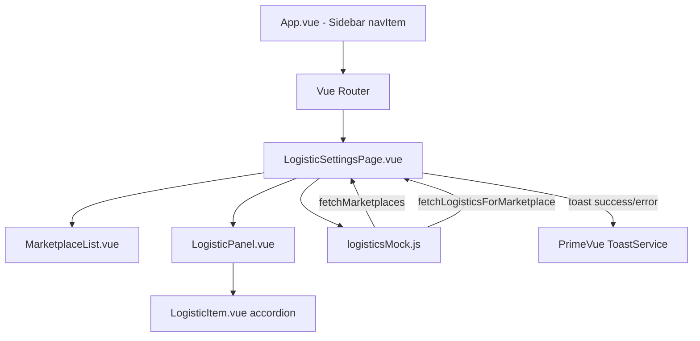
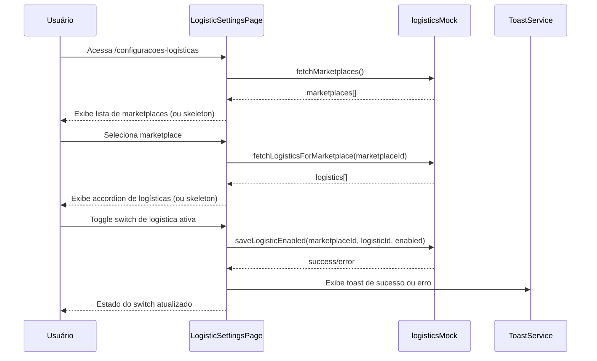

# Design Document: Configurações Logísticas por Marketplace

## Overview

Este módulo permite que o usuário visualize e configure quais modalidades logísticas estão habilitadas para cada marketplace integrado na plataforma LinkHub. O módulo segue o mesmo padrão visual e estrutural da tela de Etiquetas, utilizando o layout split (lista à esquerda + conteúdo à direita), o design system PrimeVue/Aura existente e os componentes CSS já definidos no projeto.

A tela é acessada via item de menu na sidebar, exibe os marketplaces disponíveis no painel esquerdo e, ao selecionar um marketplace, apresenta suas logísticas em formato accordion no painel direito — permitindo ativar/desativar cada uma por meio de um switch que persiste a configuração na base de dados.

---

## Architecture



### Fluxo Principal



---

## Components and Interfaces

### Component 1: `LogisticSettingsPage.vue`

**Localização:** `src/pages/LogisticSettingsPage.vue`

**Purpose:** Componente de página raiz do módulo. Coordena o estado global: lista de marketplaces, marketplace selecionado, lista de logísticas e estados de loading.

**Interface (props/emits):** Nenhuma — é um page-level component.

**Responsibilidades:**
- Chamar `fetchMarketplaces()` no `onMounted`
- Gerenciar `selectedMarketplace` e disparar `fetchLogisticsForMarketplace` ao selecionar
- Gerenciar estado de loading separado para marketplaces e logísticas
- Chamar `saveLogisticEnabled` quando o usuário faz toggle e exibir toast

---

### Component 2: `MarketplaceList.vue`

**Localização:** `src/components/logistics/MarketplaceList.vue`

**Purpose:** Painel esquerdo do split-layout. Exibe a lista de marketplaces disponíveis. Reutiliza visualmente o padrão de `CarrierList.vue`.

**Interface:**

```typescript
// Props
interface MarketplaceListProps {
  marketplaces: Marketplace[]       // Lista de marketplaces
  selectedMarketplace: Marketplace | null
  loading: boolean
}

// Emits
emit('select', marketplace: Marketplace)
```

**Responsibilidades:**
- Renderizar skeleton durante loading
- Renderizar empty-state quando não há marketplaces
- Renderizar itens clicáveis com logo, nome e contagem de logísticas
- Emitir `select` ao clicar em um item

---

### Component 3: `LogisticPanel.vue`

**Localização:** `src/components/logistics/LogisticPanel.vue`

**Purpose:** Painel direito do split-layout. Exibe o painel de logísticas do marketplace selecionado, com accordion para cada item.

**Interface:**

```typescript
// Props
interface LogisticPanelProps {
  marketplace: Marketplace | null
  logistics: Logistic[]
  loading: boolean
}

// Emits
emit('toggle', payload: { logisticId: string, enabled: boolean })
```

**Responsibilidades:**
- Exibir estado "selecione um marketplace" quando nenhum está selecionado
- Renderizar skeleton durante loading
- Renderizar empty-state quando não há logísticas
- Renderizar lista de `LogisticItem` components

---

### Component 4: `LogisticItem.vue`

**Localização:** `src/components/logistics/LogisticItem.vue`

**Purpose:** Item individual de logística em formato accordion. Exibe header (nome, ID, status, switch) e detalhe expandido.

**Interface:**

```typescript
// Props
interface LogisticItemProps {
  logistic: Logistic
  saving: boolean   // true enquanto a requisição de salvar está em andamento
}

// Emits
emit('toggle', payload: { logisticId: string, enabled: boolean })
```

**Responsibilidades:**
- Controlar estado de expanded/collapsed localmente
- Renderizar header com nome, ID, Tag de status e InputSwitch
- Desabilitar InputSwitch e aplicar opacidade reduzida quando `logistic.status === 'Inativo'`
- Exibir Tooltip no switch desabilitado
- Renderizar detalhe expandido com todos os campos dimensionais
- Emitir `toggle` quando o switch for acionado (somente para logísticas ativas)

---

## Data Models

### Marketplace

```typescript
interface Marketplace {
  id: string           // 'MKT-001'
  name: string         // 'Mercado Livre'
  logo: string         // URL da imagem ou ícone PrimeIcons (ex: 'pi pi-shopping-bag')
  color: string        // CSS gradient para o ícone (mesmo padrão de CarrierList)
  logisticsCount: number  // Quantidade de logísticas disponíveis
}
```

**Validation Rules:**
- `id` não pode ser vazio
- `name` não pode ser vazio
- `logisticsCount` >= 0

---

### Logistic

```typescript
interface Logistic {
  id: string                    // 'LOG-001'
  name: string                  // 'PAC'
  status: 'Ativo' | 'Inativo'  // Status da logística no marketplace
  enabled: boolean              // Configuração do usuário (ativo/inativo)
  minWeight: number             // kg
  maxWeight: number             // kg
  height: number                // mm
  width: number                 // mm
  depth: number                 // mm
  maxCubicVolume: number        // dm³
  minVolume: number
  maxVolume: number
  description: string
}
```

**Validation Rules:**
- Se `status === 'Inativo'`, o campo `enabled` é ignorado para fins de UI (switch bloqueado)
- `minWeight` <= `maxWeight`
- `minVolume` <= `maxVolume`
- Todos os campos dimensionais são >= 0

---

## Algorithmic Pseudocode

### Algoritmo Principal: Inicialização da Página

```pascal
ALGORITHM initLogisticSettingsPage()
INPUT: none
OUTPUT: page state populated

BEGIN
  SET loadingMarketplaces ← true
  SET marketplaces ← []
  SET selectedMarketplace ← null
  SET logistics ← []

  TRY
    result ← AWAIT fetchMarketplaces()
    SET marketplaces ← result
  CATCH error
    DISPLAY toast(error, 'Erro ao carregar marketplaces')
  FINALLY
    SET loadingMarketplaces ← false
  END TRY
END
```

---

### Algoritmo: Seleção de Marketplace

```pascal
ALGORITHM onSelectMarketplace(marketplace)
INPUT: marketplace of type Marketplace
OUTPUT: logistics list populated for selected marketplace

BEGIN
  SET selectedMarketplace ← marketplace
  SET loadingLogistics ← true
  SET logistics ← []

  TRY
    result ← AWAIT fetchLogisticsForMarketplace(marketplace.id)
    SET logistics ← result
  CATCH error
    DISPLAY toast(error, 'Erro ao carregar logísticas')
  FINALLY
    SET loadingLogistics ← false
  END TRY
END
```

---

### Algoritmo: Toggle de Logística

```pascal
ALGORITHM onToggleLogistic(logisticId, enabled)
INPUT: logisticId: string, enabled: boolean
OUTPUT: logistic.enabled updated and persisted

BEGIN
  // Precondition: logistic must exist and be status 'Ativo'
  logistic ← logistics.find(l => l.id = logisticId)
  
  IF logistic IS NULL THEN
    RETURN
  END IF
  
  IF logistic.status = 'Inativo' THEN
    RETURN  // Bloqueado — não deve chegar aqui, mas defensivo
  END IF

  // Optimistic update
  SET logistic.enabled ← enabled
  SET savingId ← logisticId

  TRY
    AWAIT saveLogisticEnabled(selectedMarketplace.id, logisticId, enabled)
    DISPLAY toast(success, 'Configuração salva com sucesso')
  CATCH error
    // Rollback
    SET logistic.enabled ← NOT enabled
    DISPLAY toast(error, 'Erro ao salvar configuração')
  FINALLY
    SET savingId ← null
  END TRY
END
```

**Preconditions:**
- `selectedMarketplace` não é null
- `logistic.status === 'Ativo'`

**Postconditions:**
- Em caso de sucesso: `logistic.enabled` reflete o novo valor e toast de sucesso é exibido
- Em caso de erro: `logistic.enabled` é revertido ao valor anterior e toast de erro é exibido

---

### Algoritmo: Renderização do LogisticItem (UI Logic)

```pascal
ALGORITHM renderLogisticItem(logistic)
INPUT: logistic of type Logistic
OUTPUT: rendered item with correct disabled/active states

BEGIN
  isInactive ← logistic.status = 'Inativo'

  // Visual state
  IF isInactive THEN
    SET itemStyle ← { opacity: 0.5 }
    SET switchDisabled ← true
    SET tooltipText ← 'Esta logística está inativa no marketplace e não pode ser configurada.'
  ELSE
    SET itemStyle ← {}
    SET switchDisabled ← false
    SET tooltipText ← null
  END IF

  // Render header (always visible)
  RENDER name, id, statusTag, inputSwitch(disabled=switchDisabled, v-tooltip=tooltipText)

  // Render expanded detail (toggle by user click on header)
  IF expanded THEN
    RENDER minWeight, maxWeight, height, width, depth, maxCubicVolume, minVolume, maxVolume, description
  END IF
END
```

---

## Key Functions with Formal Specifications

### `fetchMarketplaces(): Promise<Marketplace[]>`

**Preconditions:**
- Conexão disponível (simulada por mock com setTimeout)

**Postconditions:**
- Retorna array de `Marketplace` (pode ser vazio)
- Simula delay de ~800ms (padrão do projeto)
- Nunca lança exceção não tratada

---

### `fetchLogisticsForMarketplace(marketplaceId: string): Promise<Logistic[]>`

**Preconditions:**
- `marketplaceId` é string não-vazia e corresponde a um marketplace existente

**Postconditions:**
- Retorna array de `Logistic` correspondentes ao marketplace
- Array pode ser vazio se o marketplace não tiver logísticas configuradas
- Simula delay de ~800ms

---

### `saveLogisticEnabled(marketplaceId: string, logisticId: string, enabled: boolean): Promise<void>`

**Preconditions:**
- `marketplaceId` e `logisticId` são strings não-vazias
- A logística referenciada tem `status === 'Ativo'`

**Postconditions:**
- Em sucesso: persistência simulada, resolve sem valor
- Em erro (simulado ~10% dos casos): rejeita com Error contendo mensagem descritiva
- Simula delay de ~600ms

---

## Example Usage

```vue
<!-- LogisticSettingsPage.vue — uso dos subcomponentes -->
<template>
  <div class="split-layout">
    <MarketplaceList
      :marketplaces="marketplaces"
      :selectedMarketplace="selectedMarketplace"
      :loading="loadingMarketplaces"
      @select="onSelectMarketplace"
    />
    <LogisticPanel
      :marketplace="selectedMarketplace"
      :logistics="logistics"
      :loading="loadingLogistics"
      @toggle="onToggleLogistic"
    />
  </div>
</template>
```

```vue
<!-- LogisticItem.vue — switch com tooltip para inativo -->
<InputSwitch
  v-model="localEnabled"
  :disabled="isInactive || saving"
  v-tooltip.top="isInactive ? tooltipText : undefined"
  @change="emit('toggle', { logisticId: logistic.id, enabled: localEnabled })"
/>
```

---

## Correctness Properties

*Uma propriedade é uma característica ou comportamento que deve ser verdadeiro em todas as execuções válidas do sistema — essencialmente, uma declaração formal sobre o que o sistema deve fazer. As propriedades servem como ponte entre especificações legíveis por humanos e garantias de correção verificáveis por máquina.*

### Property 1: Isolamento por marketplace

*Para qualquer* marketplace `m`, a chamada `fetchLogisticsForMarketplace(m.id)` retorna apenas logísticas pertencentes a `m`. Nenhuma logística de outro marketplace é exibida no painel direito.

**Validates: Requirements 3.1, 3.3**

---

### Property 2: Imutabilidade do switch inativo

*Para toda* logística `l` onde `l.status === 'Inativo'`, o InputSwitch correspondente está sempre `disabled === true`, independentemente do valor de `l.enabled`. Nenhuma interação do usuário pode alterar `l.enabled` — nenhuma chamada a `saveLogisticEnabled` é realizada, e o tooltip de bloqueio é exibido.

**Validates: Requirements 7.2, 7.4, 7.5**

---

### Property 3: Estado visual de logística inativa

*Para toda* logística `l` onde `l.status === 'Inativo'`, o LogisticItem renderizado apresenta opacidade reduzida (`opacity: 0.5`) e o Tooltip do Switch contém o texto "Esta logística está inativa no marketplace e não pode ser configurada."

**Validates: Requirements 7.1, 7.3**

---

### Property 4: Consistência de persistência (atualização otimística)

*Para qualquer* logística `l` com `l.status === 'Ativo'` e qualquer valor booleano `val`, após o usuário acionar o Switch, o estado local `logistic.enabled` é imediatamente igual a `val` antes mesmo da resolução de `saveLogisticEnabled()`.

**Validates: Requirements 6.1**

---

### Property 5: Rollback em falha

*Para qualquer* logística `l` com `l.status === 'Ativo'` cujo valor de `enabled` era `original` antes do toggle, se `saveLogisticEnabled()` rejeitar, o valor de `logistic.enabled` retorna a `original`.

**Validates: Requirements 6.3**

---

### Property 6: Feedback de Toast por resultado da operação

*Para toda* operação de toggle iniciada em uma logística ativa, um Toast de sucesso é exibido quando `saveLogisticEnabled()` resolve com sucesso, ou um Toast de erro é exibido quando `saveLogisticEnabled()` rejeita — e em ambos os casos `savingId` é limpo após a exibição.

**Validates: Requirements 6.2, 6.3, 9.3**

---

### Property 7: Persistência entre sessões (round-trip)

*Para qualquer* marketplace `m` e logística `l` com `l.status === 'Ativo'`, após `saveLogisticEnabled(m.id, l.id, val)` resolver com sucesso, a chamada subsequente de `fetchLogisticsForMarketplace(m.id)` retorna a mesma logística com `enabled === val`.

**Validates: Requirements 8.1, 8.2**

---

### Property 8: Renderização completa do header do accordion

*Para qualquer* objeto `Logistic` válido, o LogisticItem renderizado exibe no cabeçalho (estado recolhido): o nome da logística, o ID da logística, uma Tag de status com severidade `'success'` quando `status === 'Ativo'` e `'secondary'` quando `status === 'Inativo'`, e o Switch com estado correspondente.

**Validates: Requirements 4.1, 4.2**

---

### Property 9: Renderização completa dos detalhes expandidos

*Para qualquer* objeto `Logistic` válido (com qualquer valor de `status`), quando o LogisticItem está no estado expandido, todos os campos são exibidos: Peso Mínimo, Peso Máximo, Altura, Largura, Profundidade, Cubagem Máxima, Volume Mínimo, Volume Máximo e Descrição.

**Validates: Requirements 5.2, 5.3**

---

### Property 10: Independência do accordion entre itens

*Para qualquer* lista de logísticas com N itens, acionar o expand/collapse de um LogisticItem não altera o estado expandido/recolhido dos demais itens da lista.

**Validates: Requirements 5.1**

---

## Error Handling

### Erro 1: Falha ao carregar marketplaces

**Condição:** `fetchMarketplaces()` rejeita
**Resposta:** Toast de erro exibido. Lista de marketplaces permanece vazia.
**Recuperação:** Botão "Atualizar" na `page-header` permite nova tentativa de carregamento.

---

### Erro 2: Falha ao carregar logísticas

**Condição:** `fetchLogisticsForMarketplace()` rejeita após seleção de marketplace
**Resposta:** Toast de erro exibido. Painel direito exibe estado vazio ou mensagem de erro.
**Recuperação:** Usuário pode clicar novamente no marketplace para retentar.

---

### Erro 3: Falha ao salvar toggle de logística

**Condição:** `saveLogisticEnabled()` rejeita
**Resposta:** Toast de erro exibido. Switch é revertido visualmente (rollback otimístico).
**Recuperação:** Usuário pode tentar o toggle novamente.

---

### Erro 4: Nenhuma logística disponível

**Condição:** `fetchLogisticsForMarketplace()` retorna array vazio
**Resposta:** Empty-state com mensagem amigável exibida no painel direito.
**Recuperação:** N/A — estado informativo.

---

## Testing Strategy

### Unit Testing Approach

Testar funções utilitárias isoladas:
- `getStatusSeverity(status)` — mapeia `'Ativo'` → `'success'`, `'Inativo'` → `'secondary'`
- Lógica de disabled: `isInactive === true` deve implicar `switchDisabled === true`
- Rollback: após mock de erro, `logistic.enabled` deve ser o valor original

### Property-Based Testing Approach

**Library:** fast-check

- Para todo `Logistic` com `status === 'Inativo'`: `switchDisabled` deve ser `true`
- Para todo `Marketplace` `m`: logísticas retornadas de `fetchLogisticsForMarketplace(m.id)` têm `marketplaceId === m.id`
- Toggle seguido de erro sempre resulta em `enabled` igual ao valor pré-toggle

### Integration Testing Approach

- Montar `LogisticSettingsPage` com mock injetado e verificar fluxo completo: carregamento → seleção → toggle → toast
- Verificar que o toast de sucesso aparece após save bem-sucedido
- Verificar que o switch é revertido após save com erro

---

## Performance Considerations

- Loading skeletons previnem layout shift durante fetches assíncronos
- Expand/collapse dos itens de accordion é gerenciado localmente em `LogisticItem.vue` com `ref(false)` — sem impacto de reatividade global
- Mock simula delays reais (~800ms fetch, ~600ms save) para garantir que a UX de loading/saving está correta antes da integração real

---

## Security Considerations

- O switch de logísticas inativas é bloqueado tanto na UI (disabled) quanto na lógica de negócio (guard no `onToggleLogistic`), prevenindo chamadas acidentais ao backend
- Nenhuma informação sensível é exposta nos dados de logística (apenas dimensões e descrição)

---

## Dependencies

| Dependência | Versão | Uso |
|---|---|---|
| Vue 3 + Composition API | ^3.x | Framework base |
| Vue Router | ^4.x | Rota `/configuracoes-logisticas` |
| PrimeVue (Aura) | existente | InputSwitch, Tag, Badge, Skeleton, Tooltip, Toast, Button |
| PrimeFlex | existente | Utilitários CSS de layout |
| PrimeIcons | existente | Ícones da sidebar e componentes |

**Novos arquivos a criar:**

```
src/
  pages/
    LogisticSettingsPage.vue          ← Page component
  components/
    logistics/
      MarketplaceList.vue             ← Painel esquerdo
      LogisticPanel.vue               ← Painel direito
      LogisticItem.vue                ← Accordion item
  mocks/
    logisticsMock.js                  ← Mock data + async functions
```

**Alterações em arquivos existentes:**

- `src/App.vue` — adicionar item `{ path: '/configuracoes-logisticas', label: 'Config. Logísticas', icon: 'pi pi-truck' }` ao array `navItems`
- `src/main.js` — adicionar rota `{ path: '/configuracoes-logisticas', component: LogisticSettingsPage }`
